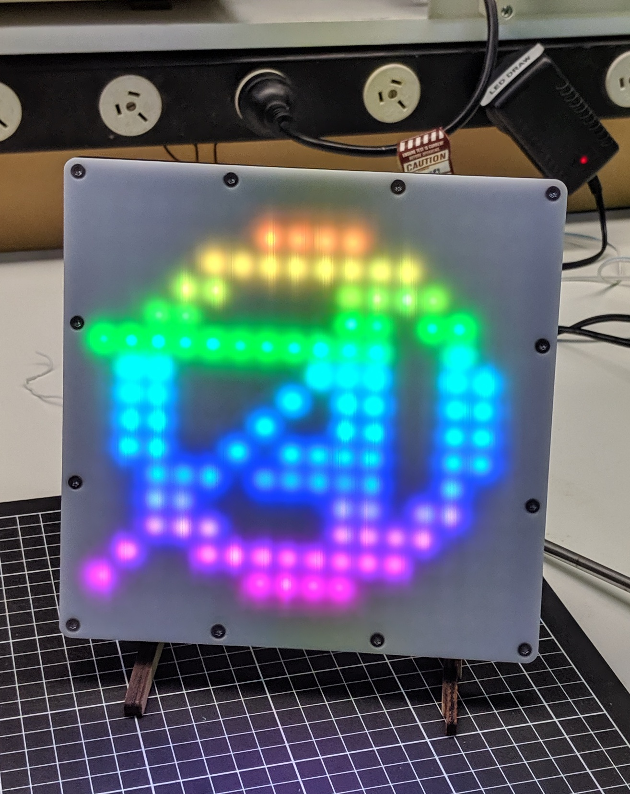

# Artifactory Draw Matrix
A WiFi controlled LED matrix that acts as a drawing canvas.

<!---->

`artifactory-draw-matrix.ino` is the code for Arduino IDE for running on a Wemos D1 mini variant of a ESP8266. The LED matrx is a WS2812B type. At max brightness white colour you could expect 4A at 5V draw. 

The purpose of the circuit is to level shift the 3.3V output of ESP8266 up to a level reliably compatible with the LEDs which expect 5V logic. Although various 5V LED strips and matrices do somtimes work with 3.3V microcontrollers it is not reliable. If you see flickering of the LEDs during animations while driving a 5V LED strip/matrix directly from a 3.3V micro then lack of level shifting may be the problem. Typical SPI/I2C level shifters don't seem to work. From various recommendations the 74HC245 buffer was used. Its a big chip at 20 pins but works well.

The rest of the circuit is general recommendations for LED strips: 200 to 500 ohm resistor in series with data pin and 1000uF cap across power supply near LED strip. See https://learn.adafruit.com/adafruit-neopixel-uberguide/best-practices.

The inspiration and much of the code is from Rui (Ray) Wang's WiFi-enabled LEDWorkshop: https://rayshobby.net/wordpress/wifi-color-led-matrix/. So thanks to him for that.

The CAD files to build the LED matrix enclosure are also included here and consist of DXF files for laser cut acrylic. White is best for front since it will help diffuse the very bright LEDs.
